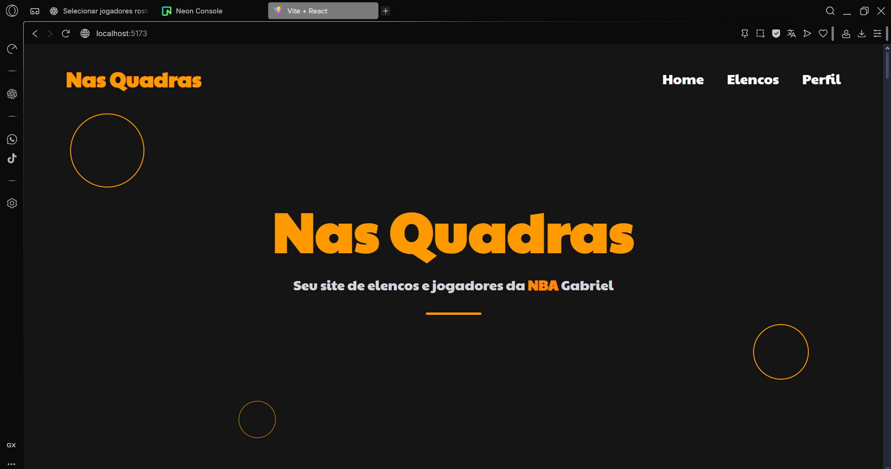
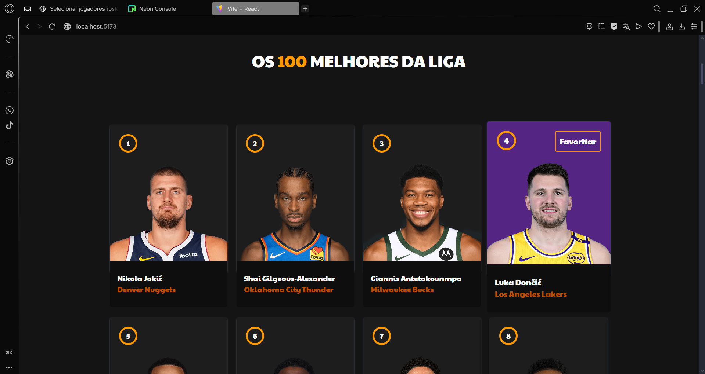
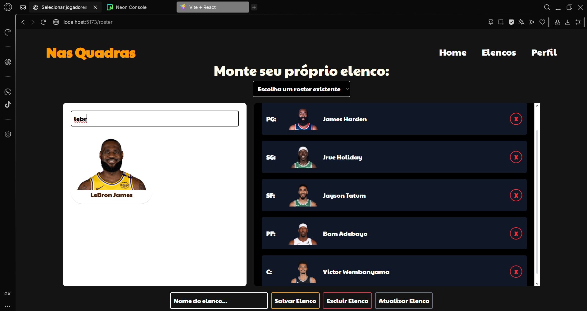
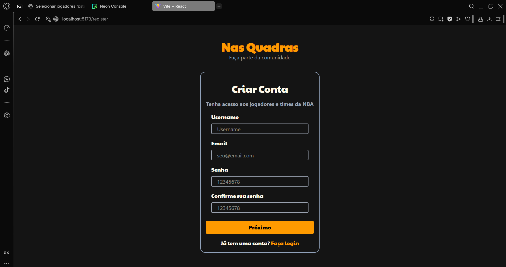

# 🏀 Projeto React - Nas Quadras

Este projeto tem como ideia central servir como uma **plataforma de informações sobre jogadores e equipes de basquete da NBA**, consumindo dados de APIs para mostrar todos os jogadores e times da liga. O projeto infelizmente não conta com notícias em tempo real, por falta de API gratuita e atualizada para tal fim.
## 🛠 Tecnologias Utilizadas

- [React]  
- [Vite]  
- [Tailwind]  

## 🎯 Objetivo

Demonstrar como construir uma aplicação **client-side** moderna com React, consumindo dados de APIs de
basquete e exibindo essas informações de forma interativa e responsiva, além de permitir que os usuários salvem suas equipes e jogadores favoritos.

## 📄 Descrição do Projeto

O sistema é composto por diversos **componentes reutilizáveis** que representam:

- Grid de jogadores e equipes;  
- PlayerCards e TeamCards;  
- Páginas focadas em jogadores, times e elencos;  
- Funcionalidades de favoritos e filtros interativos; 

## 📁 Organização de Pastas (Estrutura Geral)

- `src/`
  - `Components/`
    - `BestPlayers/` → Organiza a amostragem dos 100 melhores jogadores da liga
    - `Header/` → Cabeçalho personalizado
    - `Home/` → Página inicial da aplicação
    - `Login/` → Página completa de login
    - `PlayerCard/` → Componente exclusivo de cada jogador
    - `Profile/` → Página de perfil do usuário com preferências de times e jogadores
    - `Register/` → Página de registro
    - `Roster/` → Página de criação e gerenciamento dos elencos do usuário
    - `TeamSelector/` → Seletor de times a ser usado no Profile
  - `App.jsx` → Componente principal que orquestra os outros componentes
  - `main.jsx` → Ponto de entrada da aplicação React
- `public/` → Contém o `index.html` e ícones públicos


## 🚀 Como Executar

1. Clone o repositório:
   ```bash
   git clone [https://github.com/gabrielkazak/NasQuadras]
   cd NasQuadras
   npm install
   npm run dev
   acesse no navegador localhost:5173

## 💻 Repositório do Backend

[https://github.com/gabrielkazak/Gameboxd---Backend](https://github.com/gabrielkazak/NasQuadras---Spring)

## 🖼️ Imagens do Site









## 👤 Autor

    Gabriel – Estudante de Informática
    Projeto desenvolvido como prática de utilização de React.
